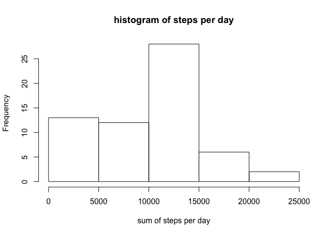
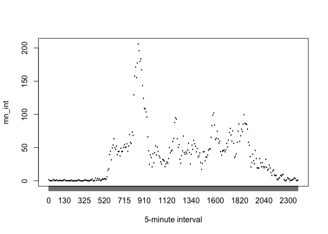
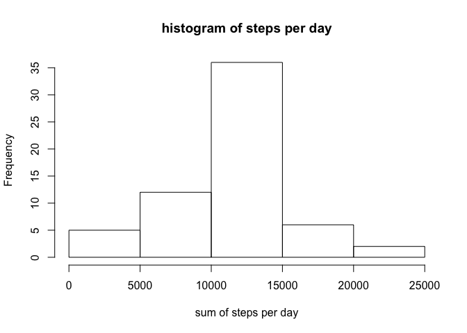
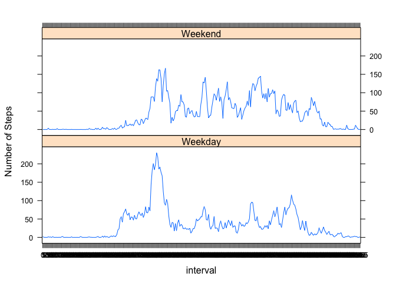

# Reproducible Research: Peer Assessment 1


## Loading and preprocessing the data
####1.Load the data:


```r
activity <- read.csv("activity.csv", header = TRUE, sep = ",", na.strings = "NA")
```

Quick look to data:

```r
str(activity)
```

```
## 'data.frame':	17568 obs. of  3 variables:
##  $ steps   : int  NA NA NA NA NA NA NA NA NA NA ...
##  $ date    : Factor w/ 61 levels "2012-10-01","2012-10-02",..: 1 1 1 1 1 1 1 1 1 1 ...
##  $ interval: int  0 5 10 15 20 25 30 35 40 45 ...
```


```r
head(activity)
```

```
##   steps       date interval
## 1    NA 2012-10-01        0
## 2    NA 2012-10-01        5
## 3    NA 2012-10-01       10
## 4    NA 2012-10-01       15
## 5    NA 2012-10-01       20
## 6    NA 2012-10-01       25
```

####2.Processing dates

```r
activity$date <- as.Date(activity$date, format = "%Y-%m-%d")
activity$interval <- factor(activity$interval)
```

## What is mean total number of steps taken per day?
####1.Calculate the total number of steps taken per day

```r
su <- tapply(activity$steps, activity$date, sum, na.rm=T)
print(su)
```

```
## 2012-10-01 2012-10-02 2012-10-03 2012-10-04 2012-10-05 2012-10-06 
##          0        126      11352      12116      13294      15420 
## 2012-10-07 2012-10-08 2012-10-09 2012-10-10 2012-10-11 2012-10-12 
##      11015          0      12811       9900      10304      17382 
## 2012-10-13 2012-10-14 2012-10-15 2012-10-16 2012-10-17 2012-10-18 
##      12426      15098      10139      15084      13452      10056 
## 2012-10-19 2012-10-20 2012-10-21 2012-10-22 2012-10-23 2012-10-24 
##      11829      10395       8821      13460       8918       8355 
## 2012-10-25 2012-10-26 2012-10-27 2012-10-28 2012-10-29 2012-10-30 
##       2492       6778      10119      11458       5018       9819 
## 2012-10-31 2012-11-01 2012-11-02 2012-11-03 2012-11-04 2012-11-05 
##      15414          0      10600      10571          0      10439 
## 2012-11-06 2012-11-07 2012-11-08 2012-11-09 2012-11-10 2012-11-11 
##       8334      12883       3219          0          0      12608 
## 2012-11-12 2012-11-13 2012-11-14 2012-11-15 2012-11-16 2012-11-17 
##      10765       7336          0         41       5441      14339 
## 2012-11-18 2012-11-19 2012-11-20 2012-11-21 2012-11-22 2012-11-23 
##      15110       8841       4472      12787      20427      21194 
## 2012-11-24 2012-11-25 2012-11-26 2012-11-27 2012-11-28 2012-11-29 
##      14478      11834      11162      13646      10183       7047 
## 2012-11-30 
##          0
```

####2.Make a histogram of the total number of steps taken each day

```r
hist(su, xlab = "sum of steps per day", main = "histogram of steps per day")
```



####3.Calculate and report the mean and median of the total number of steps taken per day

```r
mean <- round(mean(su))
median <- round(median(su))

print(sprintf("The mean is %f",mean))
```

```
## [1] "The mean is 9354.000000"
```

```r
print(sprintf("The median is %f",median))
```

```
## [1] "The median is 10395.000000"
```

## What is the average daily activity pattern?
####1.Make a time series plot of the 5-minute interval (x-axis) and the average number of steps taken, averaged across all days (y-axis)

```r
mn_int <- tapply(activity$steps, activity$interval, mean, na.rm=T)
plot(mn_int ~ unique(activity$interval), type = "1", xlab = "5-minute interval")
```



####2.Which 5-minute interval, on average across all the days in the dataset, contains the maximum number of steps?

```r
mn_int[which.max(mn_int)]
```

```
##      835 
## 206.1698
```

## Imputing missing values
####1.Calculate and report the total number of missing values in the dataset (i.e. the total number of rows with NAs)

```r
table(is.na(activity) == TRUE)
```

```
## 
## FALSE  TRUE 
## 50400  2304
```

####2.Devise a strategy for filling in all of the missing values in the dataset.
####3.Create a new dataset that is equal to the original dataset but with the missing data filled in.

```r
activity2 <- activity  # creation of the dataset that will have no more NAs
for (i in 1:nrow(activity)){
    if(is.na(activity$steps[i])){
        activity2$steps[i]<- mn_int[[as.character(activity[i, "interval"])]]
    }
}
```

####4.Make a histogram of the total number of steps taken each day and Calculate and report the mean and median total number of steps taken per day. 

```r
su2 <- tapply(activity2$steps, activity2$date, sum, na.rm=T)
hist(su2, xlab = "sum of steps per day", main = "histogram of steps per day")
```



```r
mean <- round(mean(su2))
median <- round(median(su2))

print(sprintf("The new mean is %f",mean))
```

```
## [1] "The new mean is 10766.000000"
```

```r
print(sprintf("The new median is %f",median))
```

```
## [1] "The new median is 10766.000000"
```

## Are there differences in activity patterns between weekdays and weekends?
####1.Create a new factor variable in the dataset with two levels  - "weekday" and "weekend"" indicating whether a given date is a weekday or weekend day.

```r
#Creating a factor variable "day "to store the day of the week:
activity2$day <- as.factor(weekdays(activity2$date))

#Creating a logical variable "is_weekday" (weekday=TRUE, weekend = FALE) :
activity2$is_weekday <- ifelse(!(activity2$day %in% c("Saturday","Sunday")), TRUE, FALSE) 

#Calculating the average number of steps for weekdays
weekdays_data <- activity2[activity2$is_weekday,]
steps_per_interval_weekdays <- aggregate(weekdays_data$steps, by=list(interval=weekdays_data$interval), FUN=mean)

#Calculating the average number of steps for weekends
weekends_data <- activity2[!activity2$is_weekday,]
steps_per_interval_weekends <- aggregate(weekends_data$steps, by=list(interval=weekends_data$interval), FUN=mean)

#Adding columns names
colnames(steps_per_interval_weekdays) <- c("interval", "average_steps")
colnames(steps_per_interval_weekends) <- c("interval", "average_steps")

#Adding a column to indecate the day
steps_per_interval_weekdays$day <- "Weekday"
steps_per_interval_weekends$day <- "Weekend"

#Merging the two together
week_data <- rbind(steps_per_interval_weekends, steps_per_interval_weekdays)

#Converting the day variable to a factor
week_data$day <- as.factor(week_data$day)
```

####2.Make a panel plot

```r
library(lattice)
xyplot(average_steps ~  interval | day, data = week_data, layout = c(1,2), type ="l", ylab="Number of Steps")
```


